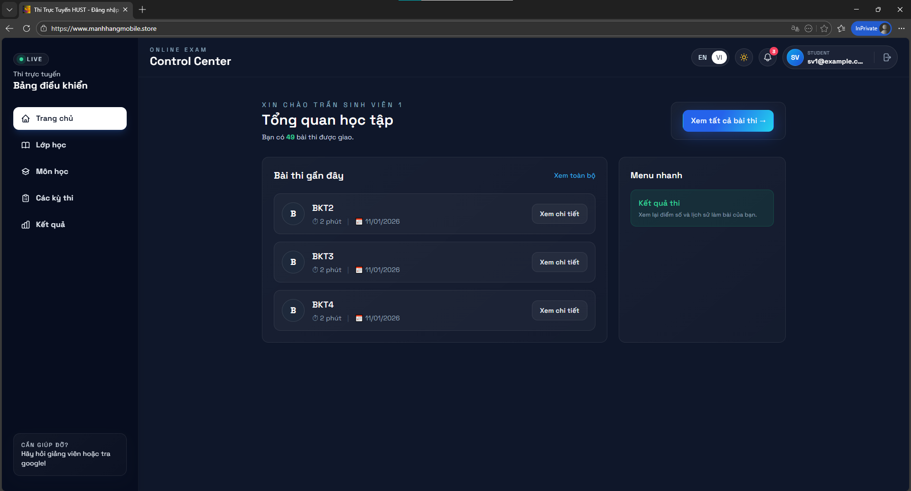
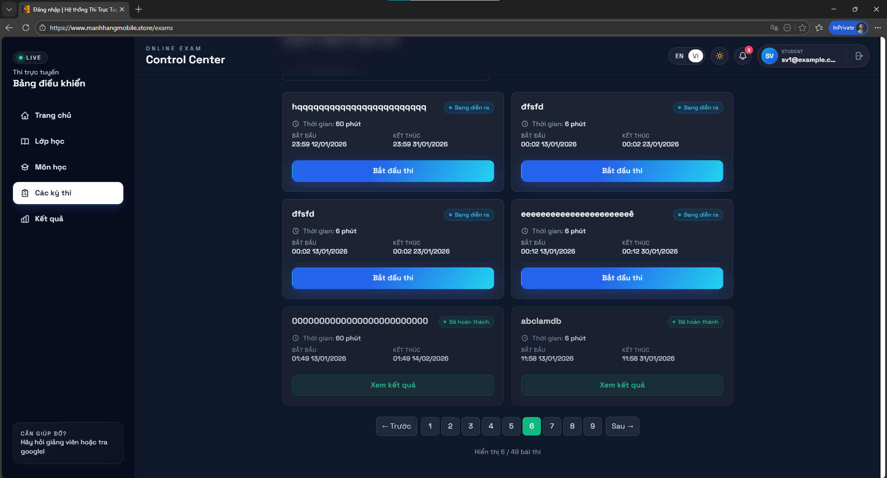
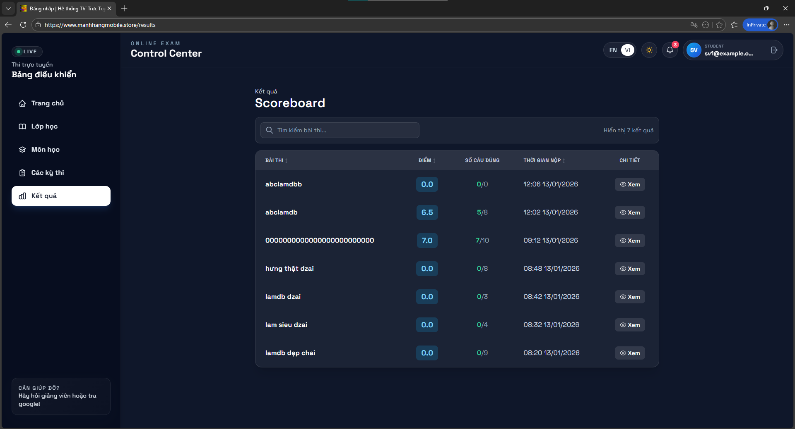

# Online Examination System (IT4409-20251)

Hệ thống thi online phục vụ sinh viên, giảng viên và quản trị viên trong quản lý – tổ chức – làm bài thi.
Giảng viên tạo lớp, blueprint đề theo chương/độ khó và lên lịch kỳ thi theo thời gian thực.
Sinh viên làm bài với bộ đếm thời gian, auto-sync đáp án qua WebSocket và tự khôi phục khi mất kết nối.
Kết quả được tổng hợp theo bài thi và hiển thị chi tiết từng câu hỏi.
Hệ thống dùng cơ chế session + phân quyền theo vai trò/permission code để kiểm soát truy cập.
Frontend React/Vite kết hợp ASP.NET Core giúp trải nghiệm mượt và dễ mở rộng.

## Demo
- FE (Vercel): https://it4409-fe.vercel.app
- Domain : https://www.manhhangmobile.store (liên hệ Mạnh Hằng Mobile Bắc Ninh mua iphone - 0868 963 999 - 0868 90 3333)
- API + Swagger: https://it4409-20251.onrender.com/swagger

## Ảnh & video




<!-- Video option 1: GIF (tự động play) -->


<!-- Video option 2: HTML tag (cần click play) -->
<video src="docs/assets/demo.mp4" controls width="100%"></video>

### 🎬 Video Demo
[](https://youtu.be/I2BNTTbmXLE)

## Tính năng theo vai trò
### Sinh viên
- Đăng nhập, xem danh sách bài thi được giao (trạng thái, thời lượng, lịch thi).
- Bắt đầu làm bài, auto-sync đáp án qua WebSocket; tự lưu/khôi phục khi refresh.
- Điều hướng câu hỏi nhanh, có bộ đếm thời gian và tự nộp khi hết giờ.
- Xem kết quả tổng quan và chi tiết từng câu (đáp án đúng/sai, điểm từng câu).

### Giảng viên
- Xem danh sách lớp được phân công và tổng quan số sinh viên/kỳ thi.
- Xem chi tiết lớp: danh sách sinh viên, danh sách kỳ thi, trạng thái làm bài.
- Tạo blueprint đề theo chương và độ khó.
- Tạo kỳ thi theo lớp/blueprint (thời gian bắt đầu/kết thúc, thời lượng).
- Xem điểm tổng hợp từng sinh viên theo kỳ thi.

### Admin
- Quản lý tài khoản (tạo/sửa/xóa, import danh sách).
- Quản lý môn học, lớp học, phân công giảng viên.
- Quản lý ngân hàng câu hỏi, import JSON.
- Quản lý kỳ thi và theo dõi kết quả.

## Tech stack
- Frontend: React 18, Vite, TypeScript, Tailwind CSS, React Router, i18next, Axios.
- Backend: ASP.NET Core 8 Web API, EF Core, SQL Server, Session auth, WebSocket.
- Tooling: Swagger/OpenAPI, Recharts (thống kê).

## Cấu trúc dự án
- `OnlineExamFe/client`: Frontend (React/Vite).
- `OnlineExamBe/OnlineExam`: Backend API (ASP.NET Core).

## Cách chạy local
### Prerequisites
- Node.js >= 18
- .NET SDK 8
- SQL Server (LocalDB hoặc Docker)

### Setup env (tham khảo từ `.env.example`)
1) Backend (ưu tiên):
   - Cập nhật connection string trong `OnlineExamBe/OnlineExam/appsettings.Development.json`,
   - hoặc set biến môi trường `ConnectionStrings__DefaultConnection`.
2) Frontend:
   - Tạo `OnlineExamFe/client/.env.local`:
     ```
     VITE_API_BASE_URL=
     VITE_API_TARGET= https://it4409-20251.onrender.com
     ```
   - Nếu không dùng proxy, đặt `VITE_API_BASE_URL=https://localhost:5133/api`
     và thêm CORS cho `http://localhost:5173` trong `OnlineExamBe/OnlineExam/Program.cs`.

### Run backend
```bash
cd OnlineExamBe/OnlineExam
dotnet restore
dotnet ef database update
dotnet run
```

### Run frontend
```bash
cd OnlineExamFe/client
npm install
npm run dev
```

## Tài khoản demo
- Student: `sv3@example.com/sv3`
- Teacher: `teacher@example.com/teacher`
- Admin: ` Mạnh Hằng Mobile Bắc Ninh/ liên hệ trực tiếp thì cho password`

## Nhóm thực hiện
Giảng viên hướng dẫn: TS. Đỗ Bá Lâm

| Họ và tên | MSSV |
| --- | --- |
| Bùi Nguyên Huy | 20225330 |
| Phạm Ngọc Hưng | 20235342 |
| Phạm Đặng Mai Hương | 20225134 |
| Lê Thị Thu Hương | 20225199 |

## Hướng phát triển (AI & nâng cao)
- AI proctoring: nhận diện khuôn mặt, phát hiện rời màn hình, cảnh báo gian lận.
- AI tạo câu hỏi/đề theo mục tiêu học tập và mức độ khó.
- Chấm tự luận bán tự động, gợi ý rubric và phản hồi cá nhân hóa.
- Adaptive testing: đề thay đổi theo năng lực người làm.
- Dashboard phân tích sâu: xu hướng điểm, độ khó câu hỏi, phát hiện câu bất thường.
